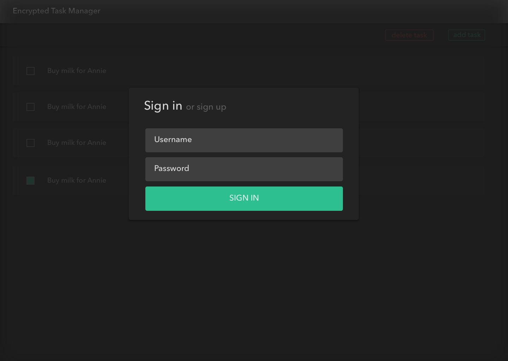
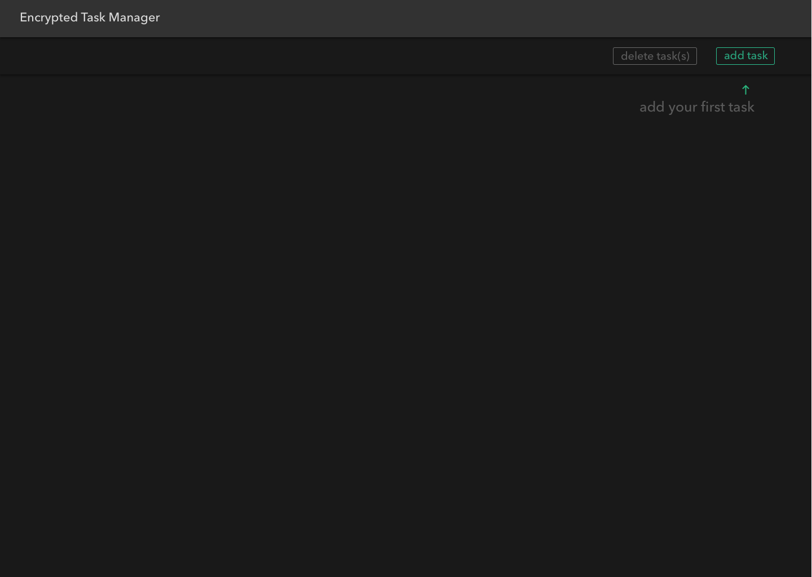
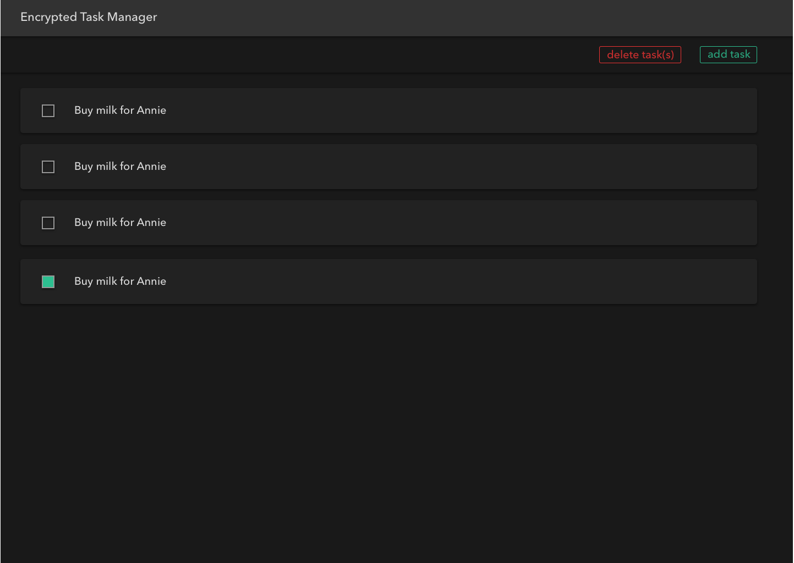

# ReactJS + Socket.IO Task Manager

Your task is to build a task manager. The primary UI will consist of a list of tasks that either marked completed or incomplete. Each task will simply consist of text, the state of this task (completed or not), and any other metadata needed. 

## Technical Implementation

The goal of this task is to build a react webapp that communicates with the server over a websocket. For the task to be successful, the app has to fulfill the following functional requirements:

- The webapp must be a single-page app
- The webapp must successfuly connect, and persist the connection to the server.
- The webapp must be able to populate a list with "tasks" supplied by the server.
- A user must be able to login with a username and a password (only a hash, SHA256, of the password is to be transmitted to the server)
- A user must be able to mark a list entry as completed
- A user must be able to create a new task, update existing ones, or delete them.
- The data within the webapp must be constantly in sync with the server.
- All data sent to the server must be encrypted with AES-256 CBC PKCS7 encryption (use a reliable library for that, lots available) using the supplied password as an encryption key, `hint: key derivation might be needed`.
- Provide unit tests showing that the correct results giving different inputs, including invalid inputs.

### Server API

- The initiated socket connection should include the username and password in the header of the request as `username` and `password`. Alternatively, you can chose not to send the username and password in the headers, and instead send them in an `authenticate` event right after you receive a `connection` event with status `pending`
    * In the case of a new username, the hash of the password will be saved along with the username and the connection will be authenticated.
    * In the case of an existing username, if the hash of the password matches the previously entered one, the connection will be authenticated. If it does not, the server will terminate the connection.
    * In case the connection is successful, the client will receive an `connection` event with `status`: `success` and `data` object containing the `username` key.

- The server will listen to the following events:

    * `getTasks`: this event will trigger the server to emit a `tasks` event back
    * `setTasks`: this event will trigger the server to save whatever data is sent, this data must include all the tasks.

- The server will emit the following events:
    * `tasks`: In case of success, this contains:
        - `status`: `success`
        - `eventName`: `getTasks`, `setTasks`, ..
        - `data`: The data the server has, that the user has last stored using the `setTasks` event (only sent in the `getTasks` event)

- In case of errors, the server will emit either a `tasks` or `connection` event (depending on the type of error), containing:
    * `statusCode`: representing one of the following http error status code (400, 401, 404, or 500)
    * `error`: the corresponding status for the status code (BadRequest, NotFound..)
    * `status`: `failed`
    * `message`: the error message
    * `eventName`: the name of the event that caused this error

### Required Information

- **Socket library:** socket.io 
- **Socket server address:** 52.26.56.105
- **Socket server port:** 5000

## Design Guidelines

Design is at the essence of myki. We strongly believe that our code is only as good as its representation to our users.

For this challenge we will stick with our basic theme.

- **Page Background**: `#191919`
- **Top Bar Background**: `#323232`
- **Top Bar Shadow**: `color rgba(0,0,0,0.5) distance 2px direction top; spread 4px`
- **error red**: `#ee3233`
- **myki green**: `#2dbf90`
- **text color**: `#fff`

### Screenshots

